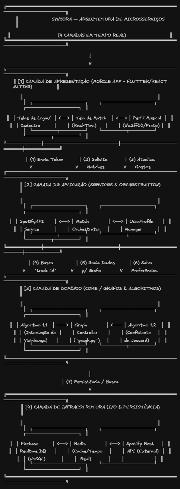

# E2 — Design Técnico, Arquitetura e Backlog

> **Disciplina:** Teoria dos Grafos  
> **Prazo:** 13 de abril de 2026  
> **Peso:** 20% da nota final  

---

## Identificação do Grupo

| Campo | Preenchimento |
|-------|---------------|
| Nome do projeto | Syncora |
| Repositório GitHub | https://github.com/Pozo1/syncora |
| Integrante 1 | Rodrigo Pozo Griecco — 38707616 |
| Integrante 2 | Gabriel Nascimento De Carlo — 40259927 |
| Integrante 3 *(se houver)* | Nome — RA |

---

## 1. Algoritmos Escolhidos

### 1.1 Algoritmo Principal

| Campo | Resposta |
|-------|----------|
| Nome do algoritmo | Interseção de Vizinhança em Tempo Real |
| Categoria | Busca em Grafo Dinâmico |
| Complexidade de tempo | O(V), onde V é o número de usuários ativos |
| Complexidade de espaço | O(V + E) |
| Problema que resolve | Identifica usuários que estão ouvindo a mesma música simultaneamente para sugerir o "match". |

**Por que este algoritmo foi escolhido?**

Para o Syncora, o "grafo" é dinâmico: as arestas entre usuários e músicas surgem e desaparecem a cada 3 minutos. A interseção de vizinhança permite encontrar rapidamente quem está conectado ao mesmo nó "Música" no exato momento do play.

<!-- Justifique a escolha para o seu domínio específico -->

**Alternativa descartada e motivo:**

| Algoritmo alternativo | Motivo da exclusão |
|----------------------|-------------------|
| Algoritmo de Prim | É voltado para Árvore Geradora Mínima, o que não se aplica à necessidade de encontrar conexões por afinidade. |

**Limitações no contexto do problema:**

O algoritmo depende da taxa de atualização da API (ex: Spotify). Se houver delay na API, o match pode ocorrer com alguns segundos de atraso após a música começar.

<!-- Liste ao menos 1 limitação relevante -->


**Referência bibliográfica:**

CORMEN, T. H. et al. Algoritmos: teoria e prática. 3. ed. Rio de Janeiro: Elsevier, 2012.

> <!-- Formato ABNT ou IEEE. Ex.: CORMEN, T. H. et al. Algoritmos: teoria e prática. 3. ed. Rio de Janeiro: Elsevier, 2012. -->

---

### 1.2 Algoritmo Adicional *(se houver)*

| Campo | Resposta |
|-------|----------|
| Nome do algoritmo | Coeficiente de Jaccard |
| Categoria | Medida de Similaridade |
| Complexidade de tempo | O(n) |
| Complexidade de espaço | O(n) |

**Justificativa:**

Após encontrar pessoas ouvindo a mesma música, usamos o Coeficiente de Jaccard para comparar o histórico de artistas favoritos de ambos e dar uma "nota de intensidade" ao match.

<!-- Por que este segundo algoritmo complementa o projeto? -->

**Referência bibliográfica:**

>  TAN, P. N.; STEINBACH, M.; KUMAR, V. Introdução ao mineração de dados. 1. ed. Rio de Janeiro: Ciência Moderna, 2009.

---

## 2. Arquitetura em Camadas

> Insira o diagrama abaixo. Pode ser exportado do Draw.io, Excalidraw, etc.



### Descrição das camadas

| Camada | Responsabilidade | Artefatos principais |
|--------|-----------------|----------------------|
| Apresentação (UI/CLI) | Interface mobile onde o usuário vê quem está "ouvindo agora". | Telas em Flutter/React Native. |
| Aplicação (Service) | Consumo da API do Spotify e lógica de notificação. | `SpotifyService.ts`, `MatchNotifier.ts`. |
| Domínio (Core) | Representação do Grafo e cálculos de similaridade. | `Graph.py`, `MatchLogic.py`. |
| Infraestrutura (I/O) | Persistência de dados e conexão com banco em tempo real. | `FirebaseConnector`, `UserRepository`. |

---

## 3. Estrutura de Diretórios

```
syncora/
├── docs/
│   ├── arquitetura_e2.png
│   ├── E1_template.md
│   └── E2_template.md
├── src/
│   ├── core/
│   │   ├── graph.py          # Lógica de Grafos e Jaccard
│   │   └── user_node.py      # Entidade de Usuário
│   ├── services/
│   │   ├── spotify_api.py    # Integração com Spotify
│   │   └── match_service.py  # Orquestração de tempo real
│   ├── mobile/
│   │   └── app_syncora/      # Código fonte do App (Flutter/React)
│   └── main.py
├── tests/
│   ├── test_graph.py
│   └── test_matches.py
├── data/
│   └── mock_users.json       # Dataset de teste
└── requirements.txt
```

> **Justificativa de desvios** *(se houver)*: A estrutura original foi adaptada para suportar a arquitetura em camadas de um projeto mobile real. Adicionamos a pasta `services/` para isolar a comunicação com a API do Spotify e a pasta `mobile/` para conter o código da interface do usuário. Essas mudanças garantem uma separação clara entre a lógica de Teoria dos Grafos (backend) e a experiência do usuário (frontend).

---

## 4. Definição do Dataset

**Formato de entrada aceito:** JSON (Ideal para integração com APIs modernas).

<!-- JSON / CSV / GraphML / lista de adjacência — descreva a estrutura -->

**Exemplo de estrutura do arquivo de entrada:**

Este arquivo representa o estado de um nó (usuário) e suas conexões dinâmicas (música atual) e estáticas (interesses):

```json
{
  "user_id": "techops_01",
  "name": "Usuario Exemplo",
  "current_session": {
    "is_active": true,
    "track_id": "spotify:track:40E9079",
    "started_at": "2026-04-20T21:30:00Z"
  },
  "static_graph_nodes": {
    "favorite_artists": ["Daft Punk", "The Weeknd", "Post Malone"],
    "genres": ["Phonk", "Synthwave", "Drift Aesthetic"]
  }
}
```

**Estratégia de geração aleatória:**

| Parâmetro | Descrição |
|-----------|-----------|
| Número de vértices | configurável via argumento |
| Densidade | configurável (0.0 a 1.0) |
| Faixa de pesos | mín/máx configuráveis |

---

## 5. Backlog do Projeto

### 5.1 In-Scope — O que será implementado

| # | Funcionalidade | Prioridade | Critério de aceite |
|---|---------------|------------|-------------------|
| 1 | Integração Spotify API | Alta | Dado que o usuário autorizou o app, quando ele der play em uma música, então o sistema deve identificar o ID da faixa em tempo real. |
| 2 | Detecção de Match Musical | Alta | Dado que dois usuários estão ouvindo a mesma música, quando ambos estiverem ativos, então o sistema deve criar uma aresta temporária no grafo entre eles. |
| 3 | Cálculo de Afinidade (Jaccard) | Alta | Dado um match por música, quando os perfis forem comparados, então o sistema deve exibir a porcentagem de artistas favoritos em comum. |
| 4 | Cadastro de Perfil e Gostos | Média | Dado o primeiro acesso, quando o usuário seleciona seus gêneros, então esses dados devem ser salvos como nós fixos de interesse no grafo. |
| 5 | Notificação de Conexão | Baixa | Dado um match de alta afinidade, quando o evento ocorrer, então ambos os usuários devem receber um alerta visual no aplicativo. |

### 5.2 Out-of-Scope — O que NÃO será feito

| Funcionalidade excluída | Motivo |
|------------------------|--------|
| Chat em tempo real | O foco principal do projeto acadêmico é a lógica de grafos e a detecção de similaridade, não a comunicação. |
| Player de áudio nativo | Para reduzir a complexidade técnica, o app utilizará Deep Links para abrir a música diretamente no Spotify. |
| Algoritmos de Recomendação por IA | Serão utilizados apenas algoritmos clássicos de grafos (Interseção e Jaccard) para cumprir a ementa da disciplina. |

---

## Checklist de Entrega

- [ok] Big-O de tempo e espaço declarados para cada algoritmo
- [ok] Ao menos 1 alternativa descartada com justificativa
- [ok] Diagrama de arquitetura com 4 camadas identificadas
- [ok] Referência bibliográfica para cada algoritmo (ABNT ou IEEE)
- [ok] Backlog com ≥ 5 itens In-Scope e ≥ 3 Out-of-Scope
- [ok] Ao menos 3 critérios de aceite no formato "dado / quando / então"
- [ok] Exemplo de estrutura de arquivo de entrada presente

---

*Teoria dos Grafos — Profa. Dra. Andréa Ono Sakai*
